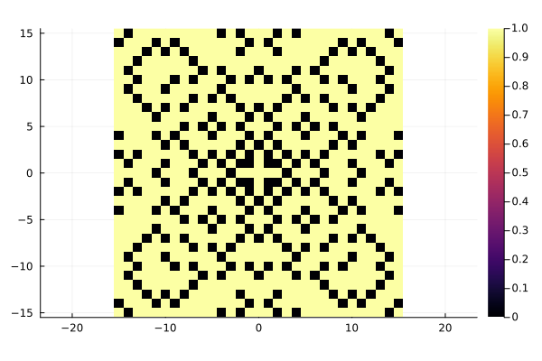

# ThieleTiles

[](https://tp2750.github.io/ThieleTiles.jl/stable/)
[](https://tp2750.github.io/ThieleTiles.jl/dev/)
[](https://github.com/tp2750/ThieleTiles.jl/actions/workflows/CI.yml?query=branch%3Amain)

This package is inspired by this paper by Steffen L. Lauritzen: http://web.math.ku.dk/~lauritzen/papers/ThieleOgGulvfliser.pdf (in Danish) abut the floow tiles designed by Thorvald Nicolai Thiele (1838-1910).

Here's an example of what it can do:

```
using Plots
using ThieleTiles

plot_gaussian_primes(15); invert_colors = true)

```



See more the the docs.
