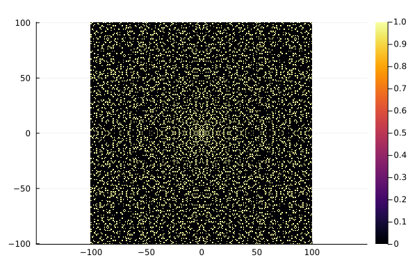
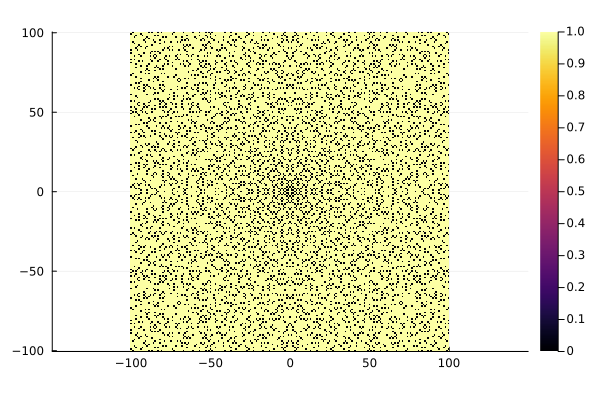
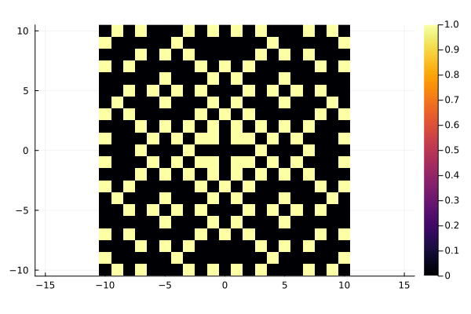
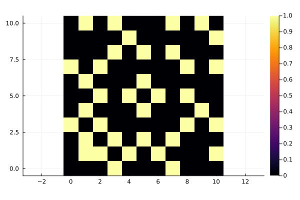
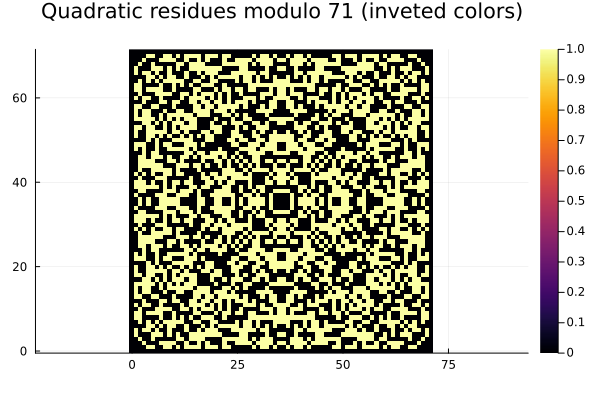
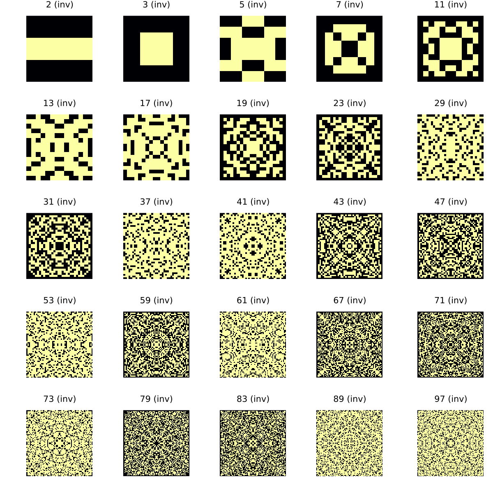
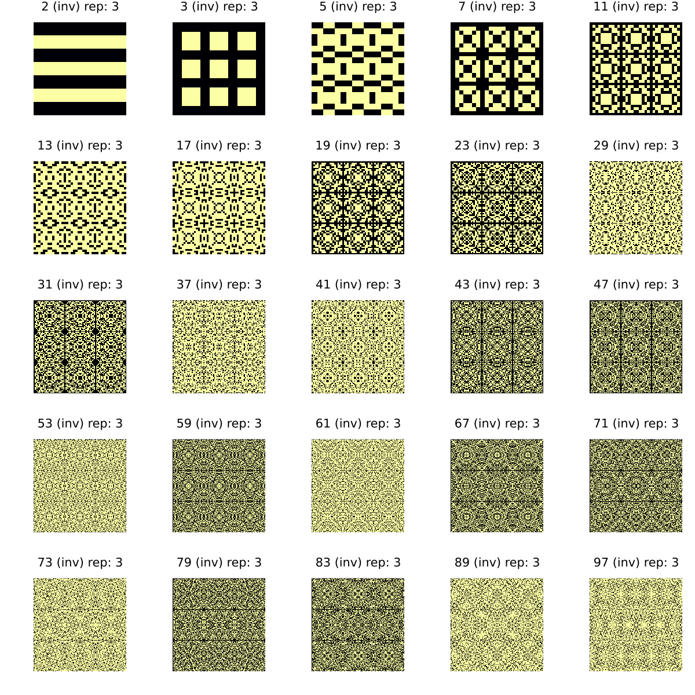

```@meta
CurrentModule = ThieleTiles
```

# ThieleTiles.jl

Documentation for [ThieleTiles](https://github.com/tp2750/ThieleTiles.jl).

This package is inspired by this paper by Steffen L. Lauritzen: <http://web.math.ku.dk/~lauritzen/papers/ThieleOgGulvfliser.pdf< (in Danish) abut the floor tiles designed by Thorvald Nicolai Thiele (1838-1910).

# Background

The tilings are based on rings of complex integers.

In particular:

* Gaussian integers: $ Z[i] = \{ x = a + ib \in C | a, b \in Z, i^2 = -1 \} $
* Eisenstein integers $ Z[\omega] = \{ x = a + \omega b \in C | a, b \in Z, \omega = (1- i\sqrt(3))/2) \} $

There is a package implementing Gaussian integers using AbstratctAlgebra.jl https://github.com/ulthiel/GaussianIntegers.jl 

The examples described in the paper relate to [Gaussian primes](https://en.wikipedia.org/wiki/Gaussian_integer#Gaussian_primes) and [Quadratic residues](https://en.wikipedia.org/wiki/Quadratic_residue)

# Examples

## Gaussian Primes

A Gaussian integer $z = a + ib$ is a gaussian prime iff one of the following holds:

1. a*b != 0 and a^2 + b^2 is a prime (in Z)
2. a = 0 and |b| is prime and |b| == 3 mod 4
3. b = 0 and |a| is prime and |a| == 3 mod 4

Eg 7 is a Gaussian prime, but 5 is not.

This packages implements a function to tile the lattice of complex integers according to this property. 
As most gaussian integers are not primes, the function includes an option to invert the colors to get a mainly light tiling.

```
using Plots
using ThieleTiles

plot_gaussian_primes(100)
plot_gaussian_primes(100; invert_colors = true)

```






The function can also take (non-symmetric) ranges:

```
plot_gaussian_primes(10)
plot_gaussian_primes(0:10, 0:10)

```






## Quadratic residues

For an odd prime integer $p \in Z$, we can compute a lot of z^2 and check which Gaussian integers with real and imaginary part 0:p we hit.

It is enough to check all a + ib, where a \in -p:p and b \in -p:p.

This is enough to compute the pattern in the Hafinia building, which is based on p = 71



The primes below 100 look as follows (note all the kw arguments, black is a quadratic residue):

```
julia> plot([plot_quadratic_residues(x; invert_colors = true, compact_title=true, simple=true) for x in primes(100)]..., size = (1200,1200))

```


The simpler ones get more interested if repeated. 
Here we repeat them all 3 times in each direction:

```
julia> plot([plot_quadratic_residues(x; invert_colors = true, compact_title=true, repeat=3, simple=true) for x in primes(100)]..., size = (1200,1200))
```




It should also be possible to do something based on the [Euler criterion](https://en.wikipedia.org/wiki/Euler%27s_criterion), which (for integers) says:

x^2 = a mod p iff  a^((p-1)/2) = 1 mod p

However, I have not been able to generalize this.
See here for hints: https://en.wikipedia.org/wiki/Quadratic_reciprocity#Gaussian_integers

```@index
```

```@autodocs
Modules = [ThieleTiles]
```
